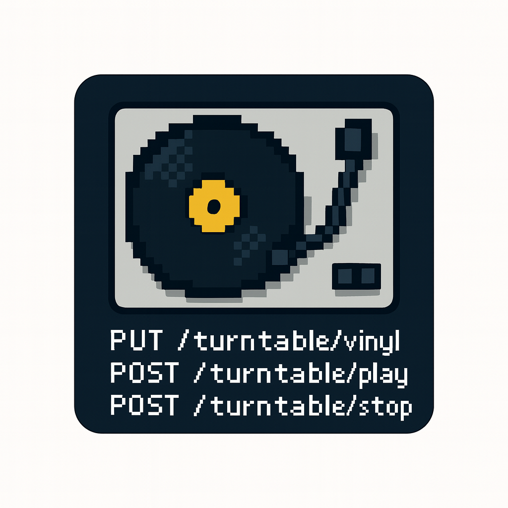
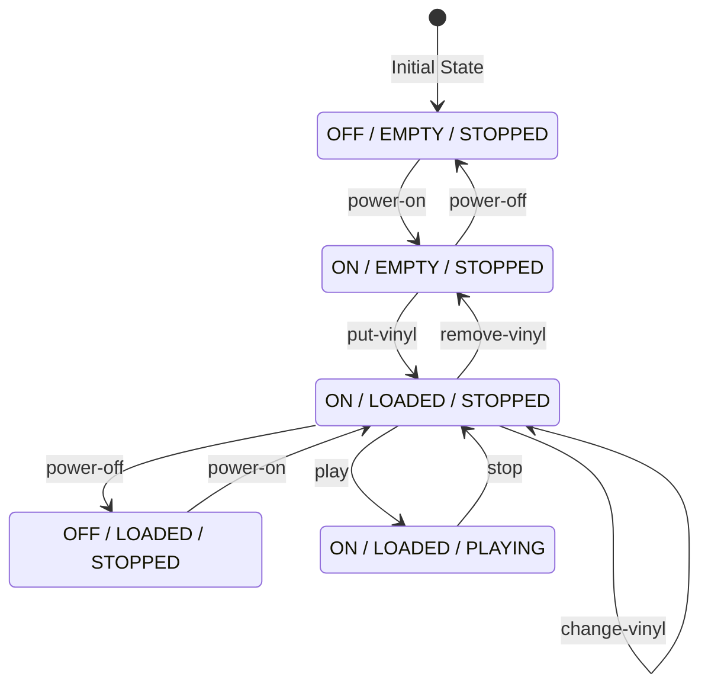

# 🎚️ Turntable API

<p align="center">
  
</p>

A **RESTful**, **HATEOAS-driven**, **finite-state-machine** API that simulates the behavior of a classic vinyl turntable.  
Built with **NestJS**, **TypeScript**, and a strong focus on API discoverability and correctness.

---

# 🌟 Features

### 🎛️ Explicit FSM (Finite State Machine)
- The turntable’s power, vinyl, and playback states form a deterministic FSM.
- Every possible transition is defined and validated centrally.
- Illegal transitions return precise `409 INVALID_STATE_TRANSITION` responses.

### 🔗 True HATEOAS Navigation
- Clients don’t need to hardcode workflow.
- Every response includes `_links` describing the *next allowed actions* based on the current state.

### 🌐 Stateless REST API
- No server-side sessions.
- Complete state is held in the turntable resource and returned in every response.

### 🎵 Built-In Vinyl Selector
- `PUT /turntable/vinyl` loads a **random** MIDI track from a curated catalog.

---

# 🧠 State Machine Overview

The turntable’s state space is defined by:

| State Dimension | Values |
|-----------------|--------|
| `powerState` | `OFF`, `ON` |
| `vinylState` | `EMPTY`, `LOADED` |
| `playbackState` | `STOPPED`, `PLAYING` |

The FSM, HATEOAS link sets, and documentation below are **auto-generated** from `src/turntable/fsm.ts`.

To regenerate derived docs:

```bash
npm run build:fsm-docs
```

---

<!-- FSM_DOCS_START -->

<!-- ⚠️ AUTO-GENERATED CONTENT - DO NOT EDIT MANUALLY ⚠️ -->
<!-- Run `npm run build:fsm-docs` to regenerate -->

## State Machine Diagram

The turntable API implements a finite state machine with the following states and transitions:



### States

| State | Power | Vinyl | Playback |
|-------|-------|-------|----------|
| S1 | OFF | EMPTY | STOPPED |
| S2 | OFF | LOADED | STOPPED |
| S3 | ON | EMPTY | STOPPED |
| S4 | ON | LOADED | STOPPED |
| S5 | ON | LOADED | PLAYING |

## HATEOAS Documentation

### Allowed Actions per State

Each state exposes only the actions that are valid transitions from that state.

| State | Power / Vinyl / Playback | Allowed Actions |
|-------|--------------------------|-----------------|
| S1 | OFF / EMPTY / STOPPED | `power-on` |
| S2 | OFF / LOADED / STOPPED | `power-on` |
| S3 | ON / EMPTY / STOPPED | `power-off`, `put-vinyl` |
| S4 | ON / LOADED / STOPPED | `power-off`, `change-vinyl`, `remove-vinyl`, `play` |
| S5 | ON / LOADED / PLAYING | `stop` |

### State Transitions

| Action | From | To | Method | Endpoint |
|--------|------|----|--------|----------|
| `power-on` | S1 | S3 | `POST` | `/turntable/power/on` |
| `power-on` | S2 | S4 | `POST` | `/turntable/power/on` |
| `power-off` | S3 | S1 | `POST` | `/turntable/power/off` |
| `power-off` | S4 | S2 | `POST` | `/turntable/power/off` |
| `put-vinyl` | S3 | S4 | `PUT` | `/turntable/vinyl` |
| `change-vinyl` | S4 | S4 | `PUT` | `/turntable/vinyl` |
| `remove-vinyl` | S4 | S3 | `DELETE` | `/turntable/vinyl` |
| `play` | S4 | S5 | `POST` | `/turntable/play` |
| `stop` | S5 | S4 | `POST` | `/turntable/stop` |

### Action Links Reference

| Action | Method | Endpoint |
|--------|--------|----------|
| `power-on` | `POST` | `/turntable/power/on` |
| `power-off` | `POST` | `/turntable/power/off` |
| `put-vinyl` | `PUT` | `/turntable/vinyl` |
| `change-vinyl` | `PUT` | `/turntable/vinyl` |
| `remove-vinyl` | `DELETE` | `/turntable/vinyl` |
| `play` | `POST` | `/turntable/play` |
| `stop` | `POST` | `/turntable/stop` |

### Example Response

When the turntable is in state **S4** (ON / LOADED / STOPPED), the response includes:

```json
{
  "powerState": "ON",
  "vinylState": "LOADED",
  "playbackState": "STOPPED",
  "currentVinyl": { "id": "...", "title": "...", "composer": "...", "midiUrl": "..." },
  "_links": {
    "self": { "href": "/turntable", "method": "GET" },
    "power-off": { "href": "/turntable/power/off", "method": "POST" },
    "change-vinyl": { "href": "/turntable/vinyl", "method": "PUT" },
    "remove-vinyl": { "href": "/turntable/vinyl", "method": "DELETE" },
    "play": { "href": "/turntable/play", "method": "POST" }
  }
}
```

### OpenAPI Specification

The OpenAPI paths are auto-generated in `tools/fsm-docs/generated/openapi-paths.yaml`.

<!-- FSM_DOCS_END -->

---

# 🚀 Installation

```bash
npm install
```

---

# ▶️ Running the API

### Development mode (watch):

```bash
npm run start:dev
```

### Production:

```bash
npm run build
npm run start:prod
```

Server defaults to:

```
http://localhost:3000
```

---

# 📡 API Endpoints

### Entry Point

```http
GET /
```

Returns the API root resource including top-level HATEOAS links.

---

### Turntable Resource

| Method | Endpoint | Description |
|--------|----------|-------------|
| `GET` | `/turntable` | Retrieve current turntable state |
| `POST` | `/turntable/power/on` | Power on |
| `POST` | `/turntable/power/off` | Power off |
| `PUT` | `/turntable/vinyl` | Put or change vinyl (random track) |
| `DELETE` | `/turntable/vinyl` | Remove vinyl |
| `POST` | `/turntable/play` | Start playback |
| `POST` | `/turntable/stop` | Stop playback |

---

# 🧪 Example Usage

```bash
# Get initial state
curl http://localhost:3000/turntable

# Power on
curl -X POST http://localhost:3000/turntable/power/on

# Put a vinyl (random selection)
curl -X PUT http://localhost:3000/turntable/vinyl

# Start playing
curl -X POST http://localhost:3000/turntable/play

# Stop playing
curl -X POST http://localhost:3000/turntable/stop
```

---

# 🗂️ Project Structure

```
src/
├── app.module.ts           # Root module
├── app.controller.ts       # Entry point
├── main.ts                 # Application bootstrap
├── health/                 # Health check
├── midi/                   # MIDI catalog + random selector
│   └── midi-tracks.service.ts
└── turntable/              # Turntable domain
    ├── turntable.controller.ts
    ├── turntable.service.ts
    ├── turntable.interface.ts
    └── fsm.ts              # Explicit finite state machine
```

---

# 📜 License

MIT
