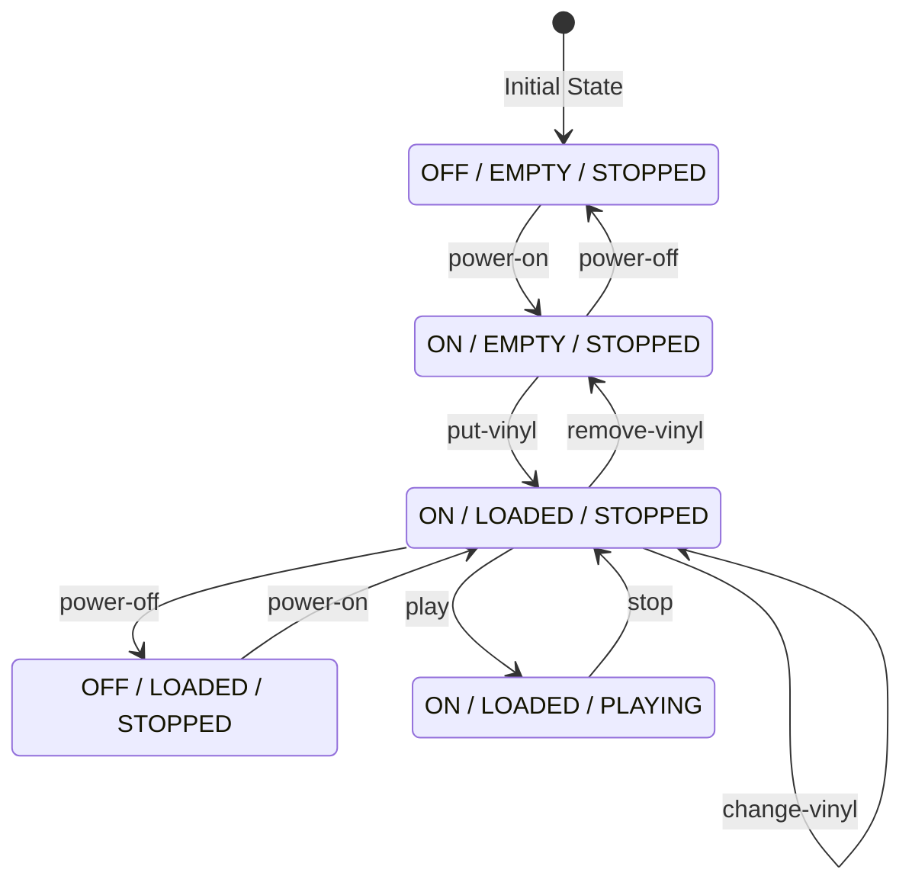

# Turntable API

A RESTful HATEOAS API simulating a vinyl turntable. Built with NestJS and TypeScript.

## Features

- **State Machine**: Manages power, vinyl loading, and playback states
- **HATEOAS**: Hypermedia-driven API with discoverable transitions
- **REST**: Clean resource-oriented endpoints

## State Machine

The turntable uses an explicit finite state machine (FSM) as the single source of truth.
The state machine, HATEOAS links, and documentation below are **auto-generated** from `src/turntable/fsm.ts`.

To regenerate after FSM changes:
```bash
npm run build:fsm-docs
```

| State Dimension | Values |
|-----------------|--------|
| `powerState` | `OFF`, `ON` |
| `vinylState` | `EMPTY`, `LOADED` |
| `playbackState` | `STOPPED`, `PLAYING` |

<!-- FSM_DOCS_START -->

<!-- ⚠️ AUTO-GENERATED CONTENT - DO NOT EDIT MANUALLY ⚠️ -->
<!-- Run `npm run build:fsm-docs` to regenerate -->

## State Machine Diagram

The turntable API implements a finite state machine with the following states and transitions:



### States

| State | Power | Vinyl | Playback |
|-------|-------|-------|----------|
| S1 | OFF | EMPTY | STOPPED |
| S2 | OFF | LOADED | STOPPED |
| S3 | ON | EMPTY | STOPPED |
| S4 | ON | LOADED | STOPPED |
| S5 | ON | LOADED | PLAYING |


## HATEOAS Documentation

### Allowed Actions per State

Each state exposes only the actions that are valid transitions from that state.

| State | Power / Vinyl / Playback | Allowed Actions |
|-------|--------------------------|-----------------|
| S1 | OFF / EMPTY / STOPPED | `power-on` |
| S2 | OFF / LOADED / STOPPED | `power-on` |
| S3 | ON / EMPTY / STOPPED | `power-off`, `put-vinyl` |
| S4 | ON / LOADED / STOPPED | `power-off`, `change-vinyl`, `remove-vinyl`, `play` |
| S5 | ON / LOADED / PLAYING | `stop` |

### State Transitions

| Action | From | To | Method | Endpoint |
|--------|------|----|--------|----------|
| `power-on` | S1 | S3 | `POST` | `/turntable/power/on` |
| `power-on` | S2 | S4 | `POST` | `/turntable/power/on` |
| `power-off` | S3 | S1 | `POST` | `/turntable/power/off` |
| `power-off` | S4 | S2 | `POST` | `/turntable/power/off` |
| `put-vinyl` | S3 | S4 | `PUT` | `/turntable/vinyl` |
| `change-vinyl` | S4 | S4 | `PUT` | `/turntable/vinyl` |
| `remove-vinyl` | S4 | S3 | `DELETE` | `/turntable/vinyl` |
| `play` | S4 | S5 | `POST` | `/turntable/play` |
| `stop` | S5 | S4 | `POST` | `/turntable/stop` |

### Action Links Reference

| Action | Method | Endpoint |
|--------|--------|----------|
| `power-on` | `POST` | `/turntable/power/on` |
| `power-off` | `POST` | `/turntable/power/off` |
| `put-vinyl` | `PUT` | `/turntable/vinyl` |
| `change-vinyl` | `PUT` | `/turntable/vinyl` |
| `remove-vinyl` | `DELETE` | `/turntable/vinyl` |
| `play` | `POST` | `/turntable/play` |
| `stop` | `POST` | `/turntable/stop` |

### Example Response

When the turntable is in state **S4** (ON / LOADED / STOPPED), the response includes:

```json
{
  "powerState": "ON",
  "vinylState": "LOADED",
  "playbackState": "STOPPED",
  "currentVinyl": { "id": "...", "title": "...", "composer": "...", "midiUrl": "..." },
  "_links": {
    "self": { "href": "/turntable", "method": "GET" },
    "power-off": { "href": "/turntable/power/off", "method": "POST" },
    "change-vinyl": { "href": "/turntable/vinyl", "method": "PUT" },
    "remove-vinyl": { "href": "/turntable/vinyl", "method": "DELETE" },
    "play": { "href": "/turntable/play", "method": "POST" }
  }
}
```


### OpenAPI Specification

The OpenAPI paths are auto-generated in `tools/fsm-docs/generated/openapi-paths.yaml`.

<!-- FSM_DOCS_END -->

## Installation

```bash
npm install
```

## Running

```bash
# Development (watch mode)
npm run start:dev

# Production
npm run build
npm run start:prod
```

The server runs on `http://localhost:3000` by default.

## API Endpoints

### Entry Point

```
GET /
```

Returns API entry point with HATEOAS links.

### Turntable Resource

```
GET    /turntable          # Get current state
POST   /turntable/power/on # Power on
POST   /turntable/power/off# Power off
PUT    /turntable/vinyl    # Put/change vinyl (random selection)
DELETE /turntable/vinyl    # Remove vinyl
POST   /turntable/play     # Start playback
POST   /turntable/stop     # Stop playback
```

### Health Check

```
GET /health
```

## Example Usage

```bash
# Get initial state
curl http://localhost:3000/turntable

# Power on
curl -X POST http://localhost:3000/turntable/power/on

# Put a vinyl
curl -X PUT http://localhost:3000/turntable/vinyl

# Start playing
curl -X POST http://localhost:3000/turntable/play

# Stop playing
curl -X POST http://localhost:3000/turntable/stop
```

## Testing

```bash
# Run tests
npm test

# Run tests with coverage
npm run test:cov
```

## Project Structure

```
src/
├── app.module.ts           # Root module
├── app.controller.ts       # Entry point controller
├── main.ts                 # Application bootstrap
├── health/                 # Health check module
├── midi/                   # MIDI tracks catalog
│   └── midi-tracks.service.ts
└── turntable/              # Turntable domain
    ├── turntable.controller.ts
    ├── turntable.service.ts
    └── turntable.interface.ts
```

## License

MIT

