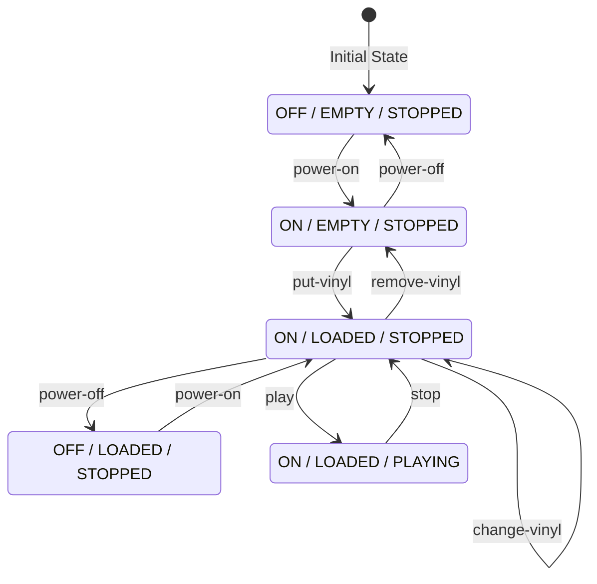

# Finite State Machine

The turntable uses an explicit finite state machine (FSM) as the single source of truth. The FSM controls:

- `powerState`: `OFF` or `ON`
- `vinylState`: `EMPTY` or `LOADED`
- `playbackState`: `STOPPED` or `PLAYING`

These combine into five valid states (S1–S5). The FSM is defined in `src/turntable/turntable.service.ts`.

:::info Auto-Generated
The diagram and tables below are auto-generated from the FSM definition.
Run `npm run build:fsm-docs` to regenerate after changes.
:::

<!-- FSM_DIAGRAM_START -->

## State Machine Diagram

The turntable API implements a finite state machine with the following states and transitions:

### States

| State | Power | Vinyl | Playback |
|-------|-------|-------|----------|
| S1 | OFF | EMPTY | STOPPED |
| S2 | OFF | LOADED | STOPPED |
| S3 | ON | EMPTY | STOPPED |
| S4 | ON | LOADED | STOPPED |
| S5 | ON | LOADED | PLAYING |

<!-- FSM_DIAGRAM_END -->
