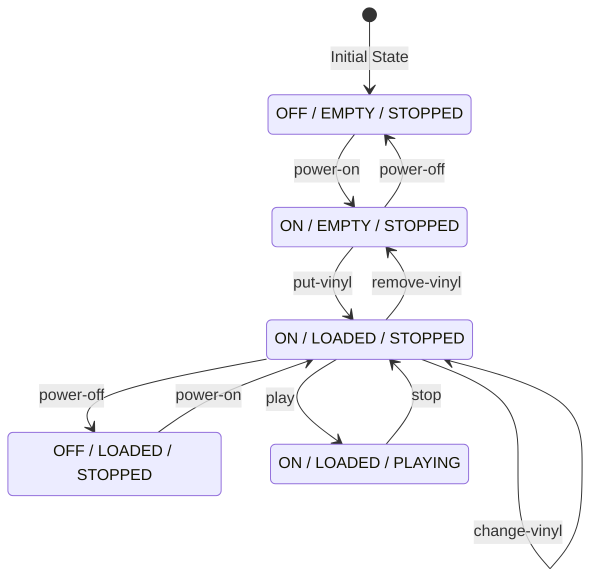

## State Machine Diagram

The turntable API implements a finite state machine with the following states and transitions:

### States

| State | Power | Vinyl | Playback |
|-------|-------|-------|----------|
| S1 | OFF | EMPTY | STOPPED |
| S2 | OFF | LOADED | STOPPED |
| S3 | ON | EMPTY | STOPPED |
| S4 | ON | LOADED | STOPPED |
| S5 | ON | LOADED | PLAYING |
